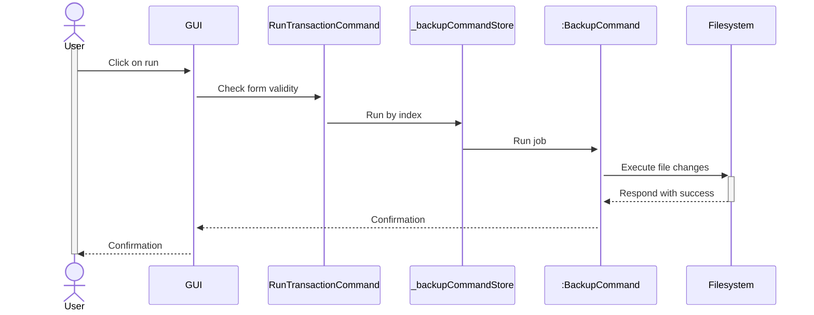
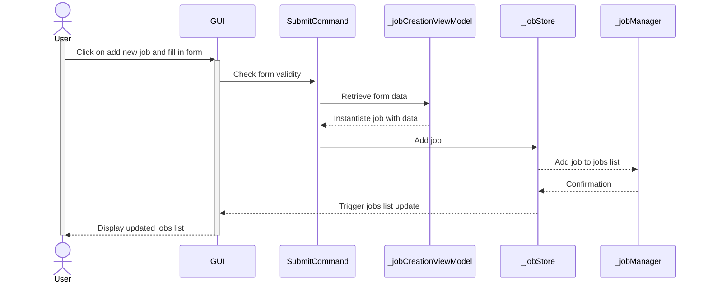
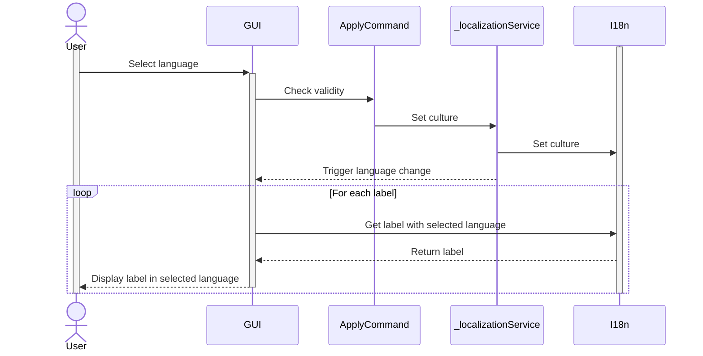
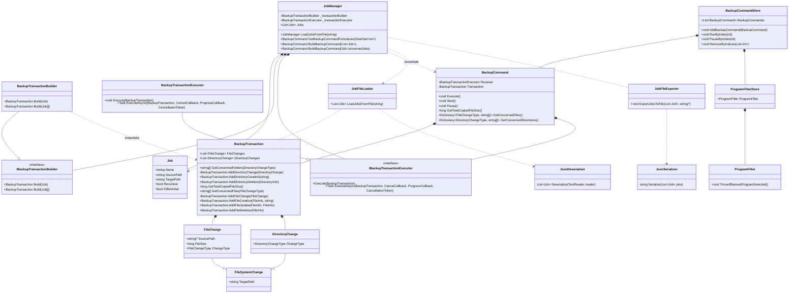

# Software engineering project

[](https://github.com/kellianb/FISE_A3_SE_BECHTEL/actions/workflows/build-and-test-linux-x64.yml)
[](https://github.com/kellianb/FISE_A3_SE_BECHTEL/actions/workflows/build-and-test-win-x64.yml)

| Project Members |
|-----------------|
| Laura GIESE     |
| Kellian BECHTEL |
| Evan CAUMARTIN  |


## Getting started

To get the CLI, you can either download it from the build artifacts of the "Build and test" GitHub action corresponding to your platform, or compile it yourself.

To compile the app, Clone this repository and run `dotnet build`.

To run backup jobs, you can either directly specify all parameters as arguments (`BackupUtil.Cli run ...`)
or load a list of backup jobs from a json file (`BackupUtil.Cli load ...`) and pick which to run.

You need to create a backup job before being able to load and run it.
Backup jobs can be created using `Backuputil.Cli create ...`.

If no filepath is specified, backup jobs are saved to, removed and loaded from:

- Linux: `~/.locale/share/EasySave/Jobs/BackupJobs.json`
- Windows: `~\AppData\Local\EasySave\Jobs\BackupJobs.json`

A daily log file containing details about all changes made by this utility can be found at:

- Linux: `~/.locale/share/EasySave/Logs`
- Windows: `~\AppData\Local\EasySave\Logs`

Currently, two languages are supported: French and English.
If your OS language is among them, the CLI will default to it.

You can also manually set your language by using the `-l ` option.

### CLI usage guide

```
Usage:
  BackupUtil.Cli [command] [options]

Options:
  -l, --locale <locale>  Locale of the application, example: 'fr-FR', 'en-GB', defaults to OS locale
  --version              Show version information
  -?, -h, --help         Show help and usage information

Commands:
  create <source-path> <target-path>  Create a backup job and write it to a file
  load                                Load backup jobs from a file and execute them
  remove                              Remove a backup job from a file
  run <source-path> <target-path>     Run a backup job
```

## UML Diagrams

### Use Case Diagram


### Sequence Diagram

#### Run a job



#### Create a new Job



#### Select language



### Class Diagram




### Activity Diagram


## Contributing
### How to make changes

- Clone the project: `git pull <repo url>`
- Create a new feature branch: `git checkout -b 'feature/<name-of-your-feature>'`
- Commit your changes: `git commit -m '<Tell us what you did and why here>'`
- Push you changes: `git push`
- Open a PR on github

### How to solve merge conflicts

Prefer git rebases over merges

Note: When done rebasing, you have to push using `git push --force`
