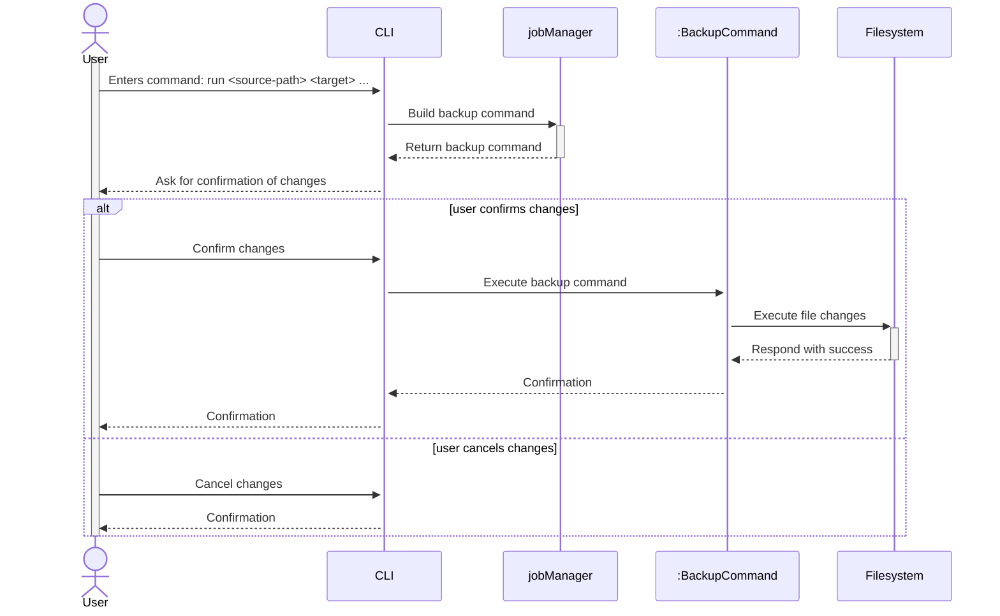
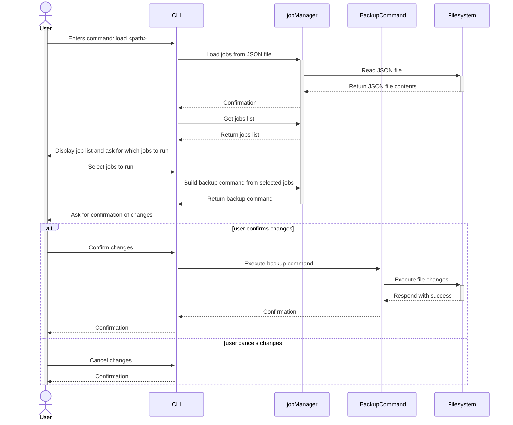
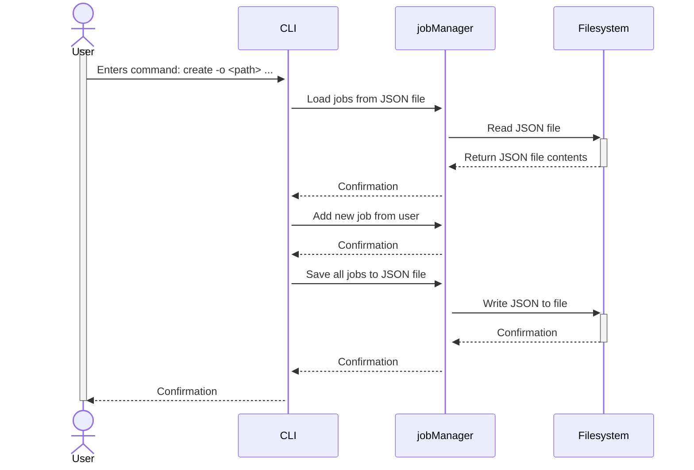
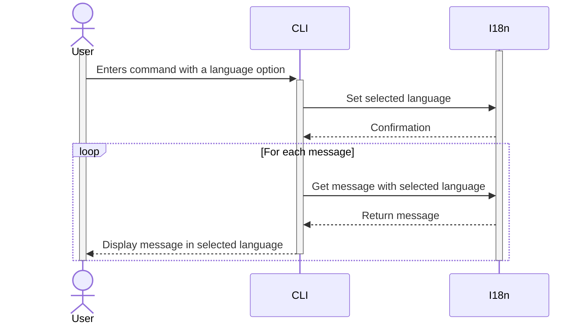
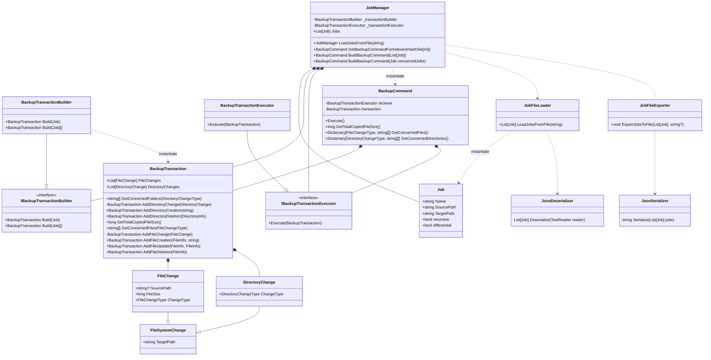

# Software engineering project

[](https://github.com/kellianb/FISE_A3_SE_BECHTEL/actions/workflows/build-and-test-linux-x64.yml)
[](https://github.com/kellianb/FISE_A3_SE_BECHTEL/actions/workflows/build-and-test-win-x64.yml)

| Project Members |
|-----------------|
| Laura GIESE     |
| Kellian BECHTEL |
| Evan CAUMARTIN  |

## CLI usage guide

```
Usage:
  BackupUtil.Cli [command] [options]

Options:
  -l, --locale <locale>  Locale of the application, example: 'fr-FR', 'en-GB', defaults to OS locale
  --version              Show version information
  -?, -h, --help         Show help and usage information

Commands:
  create <source-path> <target-path>  Create a backup job
  load <job-file-path>                Load backup jobs from a file and execute them []
  remove                              Remove a backup job
  run <source-path> <target-path>     Run a backup job
```

To use this CLI application, you need to open the CLI at the path "{location of your application}\FISE_A3_SE_BECHTEL\BackupUtil.Cli\bin\Debug\net9.0". 
Then you will be able to run the commands above with the chosen options.
You need to create a backup job with a source and a target path before loading it.
You can also directly run a backup job by specifying the source and target paths.
Once you have loaded available jobs, you can run them by selecting the job index, then confirm your choice.
The backup job will then be executed and the files will be copied from the source to the target path, and all changes will be displayed in the CLI.
The log file, generated in the local application data folder, will contain the details of the changes ("C:\Users\Utilisateur\AppData\Local\EasySave\Logs" on Windows).

You can also chose your language by using the -l option.


## How to make changes

- Clone the project: `git pull <repo url>`
- Create a new feature branch: `git checkout -b 'feature/<name-of-your-feature>'`
- Commit your changes: `git commit -m '<Tell us what you did and why here>'`
- Push you changes: `git push`
- Open a PR on github

## How to solve merge conflicts

Prefer git rebases over merges

Note: When done rebasing, you have to push using `git push --force`

## UML Diagrams

### Use Case Diagram


### Sequence Diagram

#### Create and run a single job



#### Run job(s) from JSON file



#### Create and save a Job to a JSON file



#### Select language



### Class Diagram



### Activity Diagram


