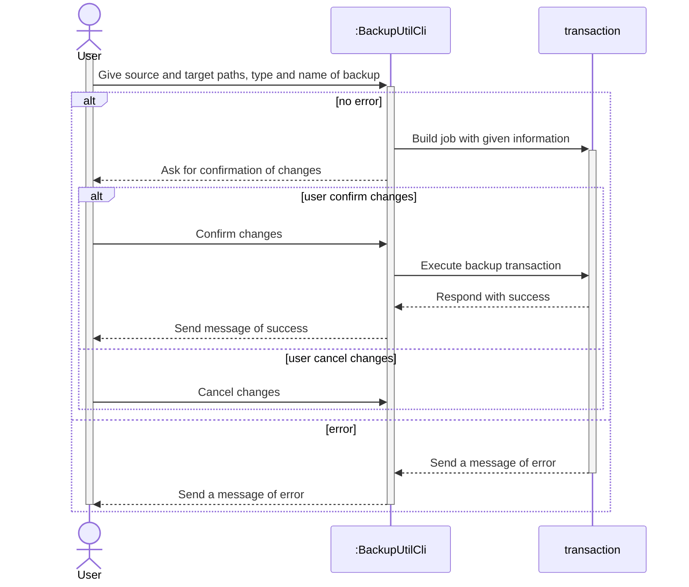
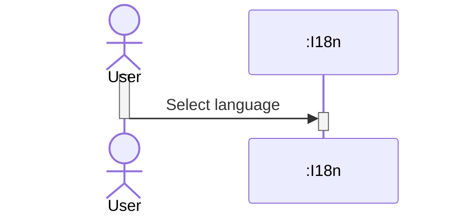
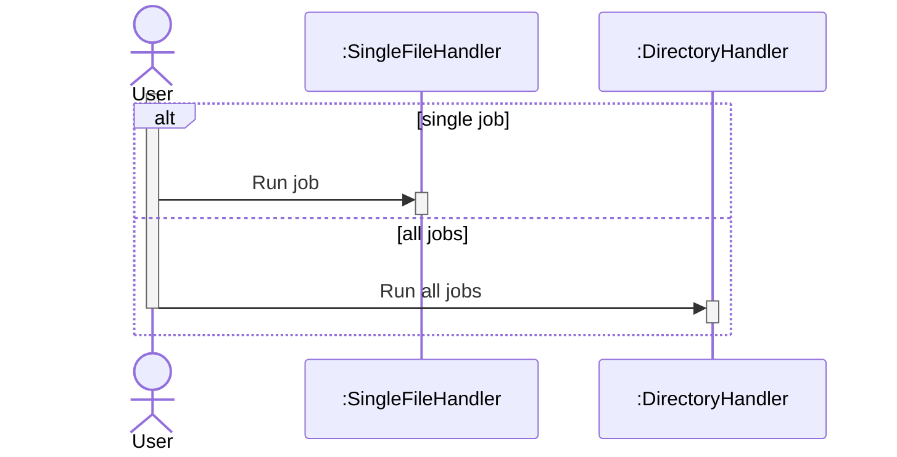

# Software engineering project

| Project Members |
|-----------------|
| Laura GIESE     |
| Kellian BECHTEL |
| Evan CAUMARTIN  |

## How to make changes

- Clone the project: `git pull <repo url>`
- Create a new feature branch: `git checkout -b 'feature/<name-of-your-feature>'`
- Commit your changes: `git commit -m '<Tell us what you did and why here>'`
- Push you changes: `git push`
- Open a PR on github


## How to solve merge conflicts

Prefer git rebases over merges

Note: When done rebasing, you have to push using `git push --force`

## UML Diagrams

### Use Case Diagram


### Sequence Diagram

#### Create and edit backup job



#### Select language



#### Run one or all jobs



#### Delete job

```mermaid
```

### Class Diagram

TODO

### Activity Diagram
