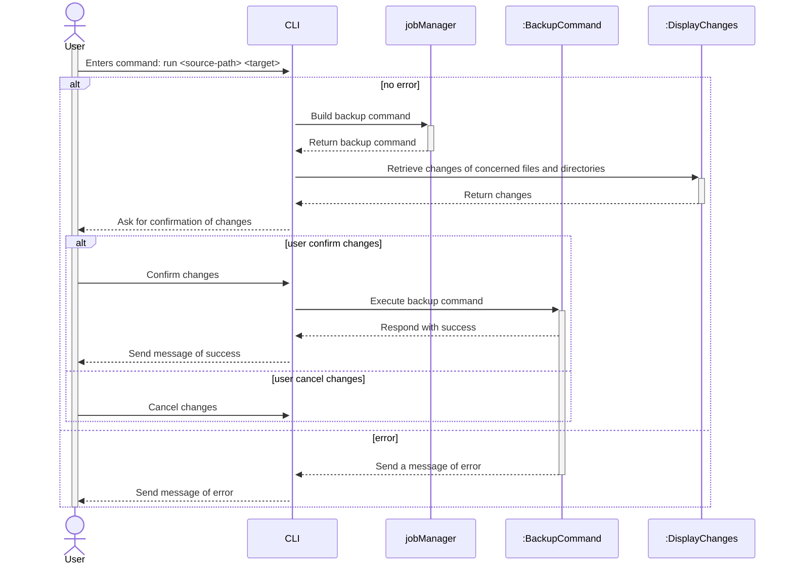
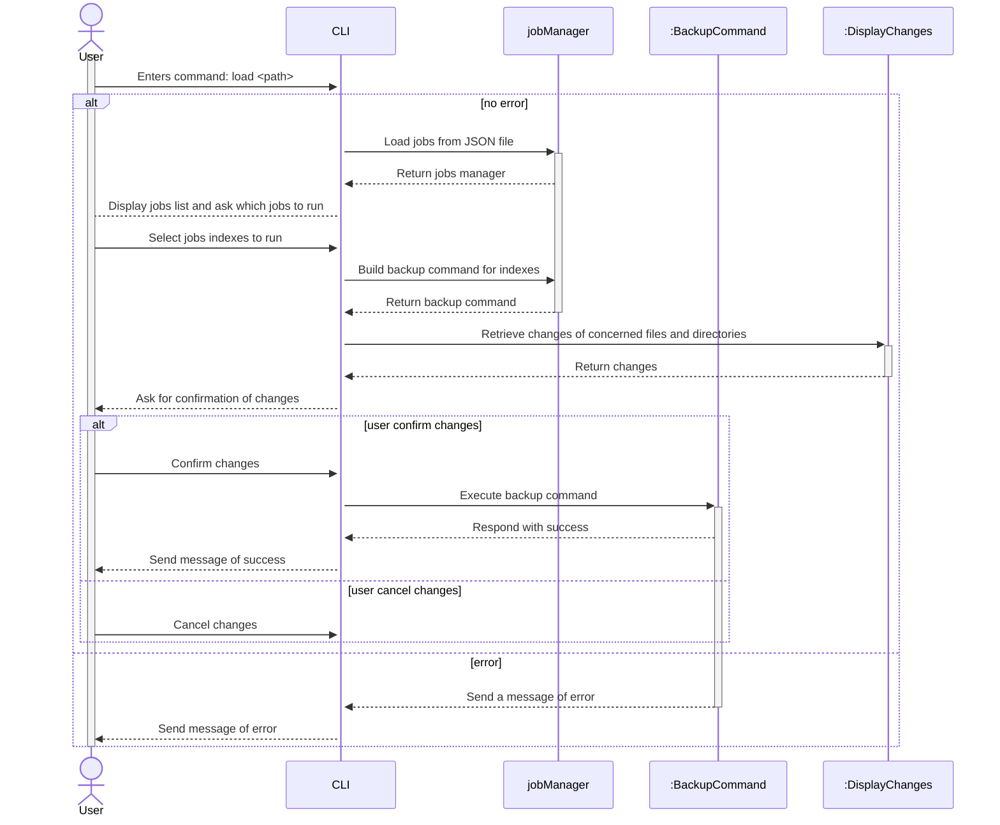

# Software engineering project

| Project Members |
|-----------------|
| Laura GIESE     |
| Kellian BECHTEL |
| Evan CAUMARTIN  |

## How to make changes

- Clone the project: `git pull <repo url>`
- Create a new feature branch: `git checkout -b 'feature/<name-of-your-feature>'`
- Commit your changes: `git commit -m '<Tell us what you did and why here>'`
- Push you changes: `git push`
- Open a PR on github


## How to solve merge conflicts

Prefer git rebases over merges

Note: When done rebasing, you have to push using `git push --force`

## UML Diagrams

### Use Case Diagram


### Sequence Diagram

#### Create and run a single job



#### Run job(s) from JSON file



#### Select language


#### Delete job

```mermaid
```

### Class Diagram

```mermaid
classDiagram

class Job {
    +string Name
    +string SourcePath
    +string TargetPath
    +bool recursive
    +bool differential
}

class FileSystemChange {
    +string TargetPath
}

class FileChange {
    +string? SourcePath
    +long FileSize
    +FileChangeType ChangeType
}

class DirectoryChange {
    +DirectoryChangeType ChangeType
}


class BackupTransaction {
    +List[FileChange] FileChanges
    +List[DirectoryChange] DirectoryChanges
    +string[] GetConcernedFolders(DirectoryChangeType)
    -BackupTransaction AddDirectoryChange(DirectoryChange)
    +BackupTransaction AddDirectoryCreation(string)
    +BackupTransaction AddDirectoryDeletion(DirectoryInfo)
    +long GetTotalCopiedFileSize()
    +string[] GetConcernedFiles(FileChangeType)
    -BackupTransaction AddFileChange(FileChange)
    +BackupTransaction AddFileCreation(FileInfo, string)
    +BackupTransaction AddFileUpdate(FileInfo, FileInfo)
    +BackupTransaction AddFileDeletion(FileInfo)
}

class IBackupTransactionBuilder {
    +BackupTransaction Build(Job)
    +BackupTransaction Build(Job[])
}

class BackupTransactionBuilder {
    +BackupTransaction Build(Job)
    +BackupTransaction Build(Job[])
}

class JobManager {
    -IBackupTransactionBuilder _transactionBuilder
    -IBackupTransactionExecutor _transactionExecutor
    +List[Job] Jobs
    +JobManager LoadJobsFromFile(string)
    +BackupCommand GetBackupCommandForIndexes(HashSet[int])
    +BackupCommand BuildBackupCommand(List[Job])
    +BackupCommand BuildBackupCommand(Job concernedJobs)
}

class IBackupTransactionExecutor {
    +Execute(BackupTransaction)
}

class BackupTransactionExecutor {
    +Execute(BackupTransaction)
}

class BackupCommand {
    -IBackupTransactionExecutor receiver
    -BackupTransaction transaction
    +Execute()
    +long GetTotalCopiedFileSize()
    +Dictionary[FileChangeType, string[]] GetConcernedFiles()
    +Dictionary[DirectoryChangeType, string[]] GetConcernedDirectories()
}

class JobFileLoader {
    +List[Job] LoadJobsFromFile(string)
}

class JsonDeserializer {
    List[Job] Deserialize(TextReader reader)
}

JobManager *-- Job
FileChange --|> FileSystemChange
DirectoryChange --|> FileSystemChange
BackupTransaction *-- FileChange
BackupTransaction *-- DirectoryChange
BackupTransactionExecutor --|> IBackupTransactionExecutor

BackupTransactionBuilder --|> IBackupTransactionBuilder
BackupTransactionBuilder ..> BackupTransaction : instantiates

JobManager *--IBackupTransactionBuilder
JobManager *--IBackupTransactionExecutor
BackupCommand *-- BackupTransaction
BackupCommand *-- IBackupTransactionExecutor

JobManager ..> BackupCommand : instantiates

JobManager ..> JobFileLoader
JobFileLoader ..> Job : instantiates
JobFileLoader ..> JsonDeserializer
```

### Activity Diagram

TODO: WIP


